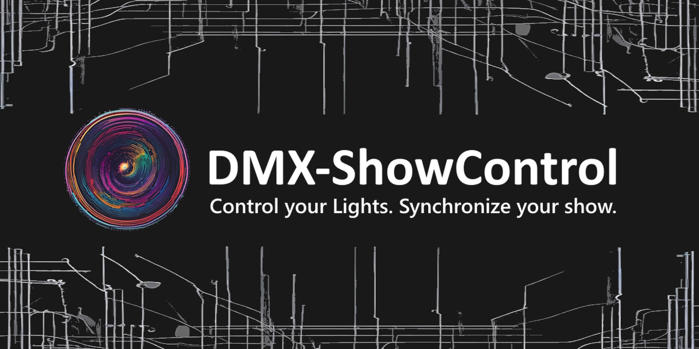

<p align="center">
  
</p>

# DMX-ShowControl

**Open-source show control software for live music and DMX lighting.**

DMX-ShowControl is a Python-based show control application designed to synchronize DMX lighting with music and live performances.

It combines **scenes, sequences, triggers, timing and DMX control** in one application, with the goal of making synchronized light shows easier to create and operate.

> [!WARNING]
> **Early Development**
>
> DMX-ShowControl is currently under active development. Features, interfaces and configuration formats may change.

---

## ✨ Features

* 🎛️ **DMX lighting control**
* 🎬 **Scenes** for predefined lighting states
* 🔀 **Sequences** for automated scene playback
* ⌨️ **Keyboard triggers**
* ⏱️ **Timing tools** for synchronizing events with music
* 🎵 **Song-based show control**
* 🔌 **Serial DMX hardware support**
* 🌐 **Web-based control interface**
* 🎹 **MIDI support** *(in development)*
* 📱 **Remote/mobile control** *(in development)*

---

## 🖥️ Current Status

DMX-ShowControl is currently under active development and is not yet considered a stable release.

Some parts of the application may still contain **German text** or untranslated interface elements. The user interface is currently being translated to English.

A standalone **Windows `.exe` release is coming soon**.

The planned executable will include the required Python runtime and dependencies, so users will not need to install Python separately.

---

## 🚀 Installation

### Development Version

Clone or download the repository:

```bash
git clone https://github.com/Fischfloskl/DMX-ShowControl.git
cd DMX-ShowControl
```

Install the required Python packages:

```bash
pip install -r requirements.txt
```

Start the application:

```bash
python main.py
```

### Windows Release

A standalone Windows `.exe` version will be released soon.

The goal is to make DMX-ShowControl usable without requiring users to install Python or configure the development environment manually.

---

## 💡 Concept

DMX-ShowControl is designed around the idea of connecting music and lighting into one show workflow.

A typical setup looks like this:

```text
        Music / Backing Track
                 │
                 ▼
          DMX-ShowControl
                 │
       ┌─────────┼─────────┐
       │         │         │
    Triggers   Timing   Sequences
       │         │         │
       └─────────┼─────────┘
                 │
                 ▼
               Scenes
                 │
                 ▼
             DMX Output
                 │
        ┌────────┼────────┐
        ▼        ▼        ▼
      Wash     Spot     Strobe
```

The goal is not to replace large professional lighting systems.

Instead, DMX-ShowControl aims to provide a **simple and flexible show-control solution**, especially for smaller live setups, musicians and personal projects.

---

## 🔌 Hardware

DMX-ShowControl is designed with affordable and DIY-friendly hardware in mind.

The current development setup uses an **Arduino** as a serial communication bridge between the computer and an **M5Stack DMX module**.

The basic communication path is:

```text
DMX-ShowControl
       │
    USB / Serial
       │
       ▼
    Arduino
       │
    DMX data
       │
       ▼
M5Stack DMX Module
       │
       ▼
  DMX Fixtures
```

The Arduino handles the communication between the computer and the DMX hardware, while the M5Stack DMX module is used for DMX output.

This setup allows DMX-ShowControl to be used with relatively inexpensive hardware instead of requiring a dedicated professional DMX interface.

Additional DMX interfaces and hardware may be supported in the future.

---

## 🛠️ Technology

* **Python**
* **Flask**
* **HTML / CSS / JavaScript**
* **Socket.IO**
* **Arduino**
* **Serial communication**
* **DMX**
* **MIDI** *(in development)*

---

## 🗺️ Roadmap

* [ ] Finish English UI translation
* [ ] Release standalone Windows `.exe`
* [ ] Improve MIDI integration
* [ ] Add MIDI Learn
* [ ] Improve DMX fixture support
* [ ] Improve the song/show workflow
* [ ] Improve mobile-friendly remote control
* [ ] Add documentation
* [ ] Add example shows and configurations

---

## 🤝 Contributing

Contributions, ideas, bug reports and feature requests are welcome.

If you find a bug or have an idea for improving DMX-ShowControl, feel free to open an **Issue**.

Pull requests are also welcome.

---

## 📄 License

DMX-ShowControl is licensed under the **GNU General Public License v3.0 (GPL-3.0)**.

See [`LICENSE`](LICENSE) for the full license text.

---

<p align="center">
  <strong>DMX-ShowControl</strong><br>
  Control your lights. Synchronize your show.
</p>
